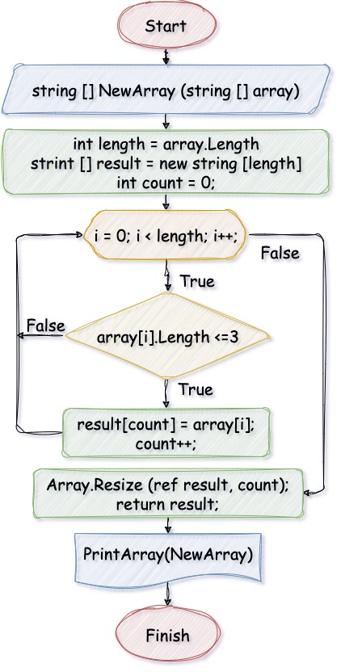

# Итоговая проверочная работа
## **Условия задачи**

Задача алгоритмически не самая сложная, однако для полноценного выполнения проверочной работы необходимо:

1. Создать репозиторий на __GitHub__
2. Нарисовать блок-схему алгоритма _(можно обойтись блок-схемой основной содержательной части, если вы выделяете её в отдельный метод)_
3. Снабдить репозиторий оформленным текстовым описанием решения _(файл __README.md__)_
4. Написать программу, решающую поставленную задачу
5. Использовать контроль версий в работе над этим небольшим проектом _(не должно быть так, что всё залито одним коммитом, как минимум этапы 2, 3, и 4 должны быть расположены в разных коммитах)_

**Задача:**

Написать программу, которая из имеющегося массива строк формирует новый массив из строк, длина которых меньше, либо равна 3 символам. Первоначальный массив можно ввести с клавиатуры, либо задать на старте выполнения алгоритма. При решении не рекомендуется пользоваться коллекциями, лучше обойтись исключительно массивами.

**Примеры:**
```
[“Hello”, “2”, “world”, “:-)”] → [“2”, “:-)”]
[“1234”, “1567”, “-2”, “computer science”] → [“-2”]
[“Russia”, “Denmark”, “Kazan”] → []
```
***

## **Решение**
1. Создал новый репозиторий `FinalWork` на __GitHub__.
2. Блок-схема алгоритма:
> 
3. Добавил новый файл `README.md`
4. Программа находится в ветке [`task`](/FinalWork/Program.cs "Открыть решение")

Код программы:
```cs
Console.Clear();

ListArrays();

void ListArrays()
{
    Console.WriteLine();
    Console.WriteLine("СПИСОК МАССИВОВ:");
    Console.WriteLine("1ый массив: [“Hello”, “2”, “world”, “:-)”]");
    Console.WriteLine("2ой массив: [“1234”, “1567”, “-2”, “computer science”]");
    Console.WriteLine("3ий массив: [“Russia”, “Denmark”, “Kazan”]");
    Console.WriteLine();
}

string? InputArray(string cmd)
{
    Console.Write(cmd);
    return Console.ReadLine();
}

string[] array = new string[] { };
string? arrayCases = InputArray("Выберите массив: ");
switch (arrayCases)
{
    default:
        Console.WriteLine($"{arrayCases} - Такого массива нет.");
        break;
    case "1":
        array = new string[] { "Hello", "2", "world", ":-)" };
        break;
    case "2":
        array = new string[] { "1234", "1567", "-2", "computer science" };
        break;
    case "3":
        array = new string[] { "Russia", "Denmark", "Kazan" };
        break;
}

string[] NewArray(string[] array)
{
    int length = array.Length;
    string[] result = new string[length];
    int count = 0;
    for (int i = 0; i < length; i++)
    {
        if (array[i].Length <= 3)
        {
            result[count] = array[i];
            count++;
        }
    }
    Array.Resize(ref result, count);
    return result;
}

void PrintArray(string[] array)
{
    Console.Write("[");
    for (int i = 0; i < array.Length; i++)
    {
        if (i < array.Length - 1) Console.Write($"“{array[i]}”, ");
        else Console.Write($"“{array[i]}”");
    }
    Console.Write("]");
}

PrintArray(array);
Console.Write(" -> ");
string[] newArray = NewArray(array);
PrintArray(newArray);
```

Результат вывода в терминал:
> 